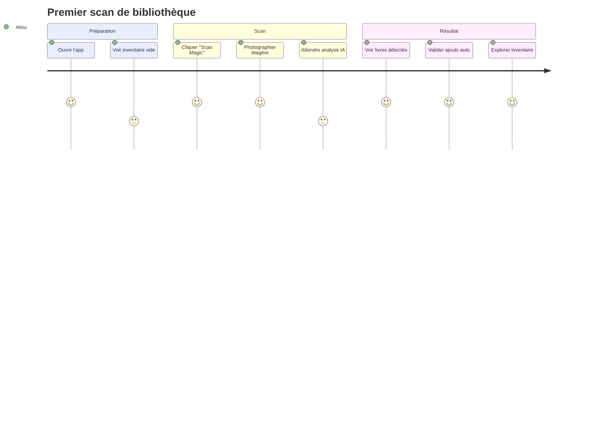
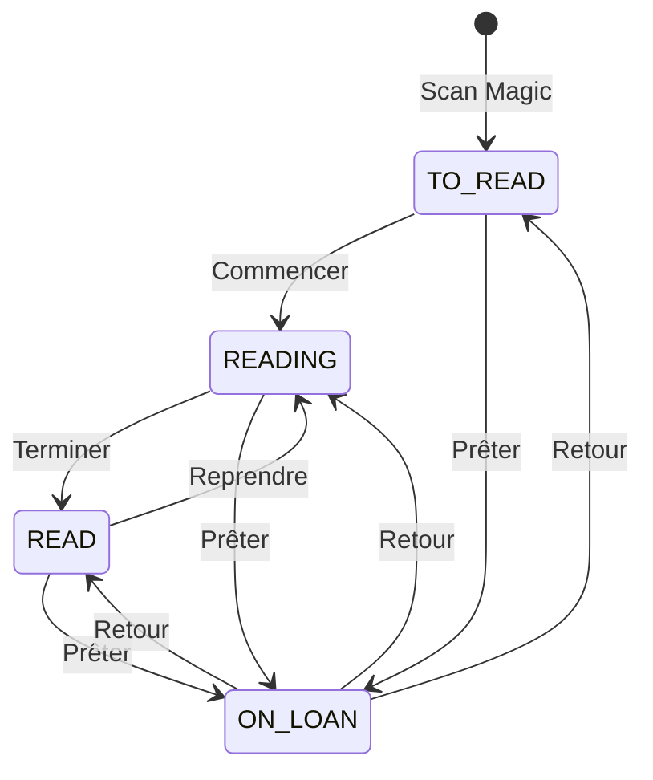

# Documentation Fonctionnelle - Arcana

> Spécifications fonctionnelles, user stories et règles métier

---

## 📋 Table des Matières

1. [Vision Produit](#vision-produit)
2. [Personas](#personas)
3. [User Stories](#user-stories)
4. [Règles Métier](#règles-métier)
5. [Parcours Utilisateur](#parcours-utilisateur)
6. [États et Transitions](#états-et-transitions)

---

## Vision Produit

> **Arcana** est le **foyer numérique** de notre maison. Il connecte Sylvia, Aliou, Sacha et Lisa à travers une organisation partagée et des moments de découverte.

### Principes de Design

| Principe | Description |
|----------|-------------|
| 🍎 **Simplicité Apple** | Interfaces épurées, zéro friction |
| 🎨 **shadcn/ui natif** | Aucun CSS custom, white-label ready |
| ✨ **Vibe Engineering** | Animations fluides, feedback satisfaisant |
| 👶 **Mode Enfants** | UI adaptée pour Sacha (9) et Lisa (6) |
| 🛡️ **Zero-Debt** | TypeScript strict, Zod partout |

---

## Personas

### 👨‍💼 Aliou (Développeur / Admin)
- Configure le système
- Ajoute les livres en masse via Magic Scan
- Gère les paramètres techniques

### 👩‍💼 Sylvia (Product Owner / Utilisatrice principale)
- Utilise l'inventaire quotidiennement
- Gère les prêts aux amis/voisins
- Valide l'UX ("Si ça a besoin d'un manuel, c'est cassé")

### 👦 Sacha (9 ans)
- Explore les livres en Mode Enfants
- Marque ses lectures
- Reçoit des confettis 🎉

### 👧 Lisa (6 ans)
- Interface très simplifiée
- Grosses cibles tactiles
- Animations de succès

---

## User Stories

### US1: Magic Shelf Scan ✅

**En tant que** parent
**Je veux** photographier mon étagère entière
**Afin que** tous les livres soient automatiquement identifiés et ajoutés à l'inventaire en une seule fois

#### Critères d'acceptation

| # | Critère | Statut |
|---|---------|--------|
| 1 | Capture via caméra (mobile ou desktop) | ✅ |
| 2 | Gemini Flash identifie TOUS les livres visibles | ✅ |
| 3 | Validation croisée Google Books API pour chaque livre | ✅ |
| 4 | Auto-insertion si confiance ≥ 70% (sans message bloquant) | ✅ |
| 5 | Détection de doublons avec badge "Copie multiple" | ✅ |
| 6 | Skip silencieux des livres illisibles | ✅ |
| 7 | Affichage stats: détectés, ajoutés, doublons, ignorés | ✅ |

#### Scénario nominal

```gherkin
Given je suis sur l'écran d'inventaire
When je clique sur "Scan Magic"
And je prends une photo de mon étagère complète
Then le système identifie TOUS les livres visibles
And affiche les statistiques du scan
And ajoute automatiquement ceux avec confiance ≥ 70%
And ignore silencieusement les livres illisibles
```

---

### US2: Inventaire Intelligent ✅

**En tant qu'** utilisateur
**Je veux** voir mes livres dans une grille avec des filtres puissants
**Afin de** trouver rapidement n'importe quel livre dans notre bibliothèque familiale

#### Critères d'acceptation

| # | Critère | Statut |
|---|---------|--------|
| 1 | Layout en grille avec couvertures HD Google Books | ✅ |
| 2 | Badges de statut: "À lire", "En cours", "Lu" | ✅ |
| 3 | Sidebar de filtres (statut, propriétaire, catégorie, auteur) | ✅ |
| 4 | Recherche textuelle | ✅ |
| 5 | Indicateur "Copie multiple" | ✅ |
| 6 | Badge propriétaire sur chaque livre | ✅ |

---

### US3: Suivi des Prêts ✅

**En tant que** Sylvia
**Je veux** marquer un livre comme "Prêté à X"
**Afin de** ne plus perdre de livres chez les amis

#### Critères d'acceptation

| # | Critère | Statut |
|---|---------|--------|
| 1 | Champ `loanedTo` sur chaque livre | ✅ |
| 2 | Badge "En prêt" affiché sur la carte | ✅ |
| 3 | Suivi du retour via API | ✅ |

---

### US4: Cartes de Lecture IA (Anti-Spoiler) ✅

**En tant que** parent
**Je veux** obtenir des insights générés par IA SEULEMENT après avoir marqué "Lu"
**Afin de** pouvoir discuter du livre avec les enfants sans spoiler

#### Critères d'acceptation

| # | Critère | Statut |
|---|---------|--------|
| 1 | **Règle Anti-Spoiler**: Carte accessible uniquement si status = READ | ✅ |
| 2 | Gemini Pro génère du contenu premium | ✅ |
| 3 | Résumé profond (5-7 phrases) | ✅ |
| 4 | Thèmes clés extraits | ✅ |
| 5 | Questions de discussion pour enfants | ✅ |
| 6 | Recommandation de niveau de lecture | ✅ |
| 7 | Livres "Non lu" n'affichent que les données neutres Google Books | ✅ |

---

### US5: Statut de Lecture par Utilisateur ✅

**En tant que** membre de la famille
**Je veux** suivre ma propre progression de lecture indépendamment
**Afin que** chaque personne sache ce qu'elle a lu vs. ce que les autres ont lu

#### Critères d'acceptation

| # | Critère | Statut |
|---|---------|--------|
| 1 | Modèle `ReadingStatus` liant User + Book | ✅ |
| 2 | Chaque membre peut marquer son propre statut | ✅ |
| 3 | Vue "qui a lu quoi" sur la page détail | ✅ |

---

### US6: Mode Enfants ✅

**En tant que** Sacha/Lisa
**Je veux** une interface fun et simplifiée
**Afin de** pouvoir explorer les livres sans menus complexes

#### Critères d'acceptation

| # | Critère | Statut |
|---|---------|--------|
| 1 | Toggle dans le header | ✅ |
| 2 | Cibles tactiles plus grandes | ✅ |
| 3 | Labels riches en emojis | ✅ |
| 4 | Navigation simplifiée | ✅ |
| 5 | Affichage de contenu adapté à l'âge | ✅ |

---

## Profils Famille

L'application est pré-configurée avec la famille Konteye:

| Membre | Date de naissance | Rôle |
|--------|-------------------|------|
| **Aliou** | 05.05.1985 | Parent |
| **Sylvia** | 05.09.1986 | Parent |
| **Sacha** | 08.11.2016 | Enfant |
| **Lisa** | 31.10.2019 | Enfant |

---

## Règles Métier

### R1: Seuil de Confiance

```
SI confiance_finale ≥ 0.70
  ALORS insertion automatique en base (silencieuse)
SINON
  ALORS ignorer silencieusement (pas de message d'erreur)
```

**Calcul de confiance finale:**
```
confiance_finale = (confiance_gemini + confiance_google_books) / 2
```

### R2: Gestion des Doublons

```
SI livre existe (titre + auteur similaires, case-insensitive)
  ALORS incrémenter copyNumber du livre existant
  ET afficher badge "Copie multiple"
SINON
  ALORS créer nouveau livre avec copyNumber = 1
```

### R3: Règle Anti-Spoiler

```
SI utilisateur demande carte de lecture
  ET statut_utilisateur != READ
  ALORS retourner erreur 403
  ET message: "Vous devez d'abord lire ce livre"
```

### R4: Cycle de Vie du Statut (par utilisateur)

| Transition | De → Vers | Déclencheur |
|------------|-----------|-------------|
| Nouveau | → TO_READ | Scan Magic |
| Commencer | TO_READ → READING | Action utilisateur |
| Terminer | READING → READ | Action utilisateur |
| Reprendre | READ → READING | Action utilisateur |

### R5: Propriétaire par Défaut

Tout nouveau livre scanné est assigné à `FAMILY` par défaut. L'utilisateur peut ensuite changer le propriétaire vers un membre spécifique (ALIOU, SYLVIA, SACHA, LISA).

---

## Parcours Utilisateur

### Parcours 1: Première utilisation (Magic Scan)



### Parcours 2: Gestion quotidienne

```mermaid
flowchart LR
    A[Ouvrir App] --> B{Action?}
    B -->|Consulter| C[Parcourir Grille]
    B -->|Chercher| D[Barre de recherche]
    B -->|Ajouter| E[Scan Magic]
    B -->|Prêter| F[Sélectionner livre]

    C --> G[Voir détails]
    D --> G
    F --> H[Saisir emprunteur]
    H --> I[Badge "En prêt"]

    G --> J{Changer statut?}
    J -->|Oui| K[TO_READ → READING → READ]
    J -->|Non| L[Retour grille]
```

---

## États et Transitions

### États d'un Livre



### Statuts visuels

| Statut | Badge | Couleur |
|--------|-------|---------|
| TO_READ | "À lire" | `secondary` (gris) |
| READING | "En cours" | `primary` (bleu) |
| READ | "Lu" | `success` (vert) |
| ON_LOAN | "En prêt" + nom | `warning` (orange) |
| MULTIPLE | "x2", "x3"... | Badge superposé |

---

## Glossaire

| Terme | Définition |
|-------|------------|
| **Magic Scan** | Fonctionnalité de scan IA d'étagère complète |
| **Confiance** | Score 0-1 indiquant la certitude de l'identification |
| **Copie multiple** | Indicateur qu'un livre existe en plusieurs exemplaires |
| **Mode Enfants** | Interface simplifiée pour Sacha et Lisa |
| **Clean Architecture** | Pattern séparant contrôleurs, services, repositories |

---

## Liens utiles

- [📐 Documentation Technique](./TECHNICAL.md)
- [🔌 Référence API](./API.md)
- [📜 Manifeste Produit](../PRODUCT_MANIFESTO.md)
